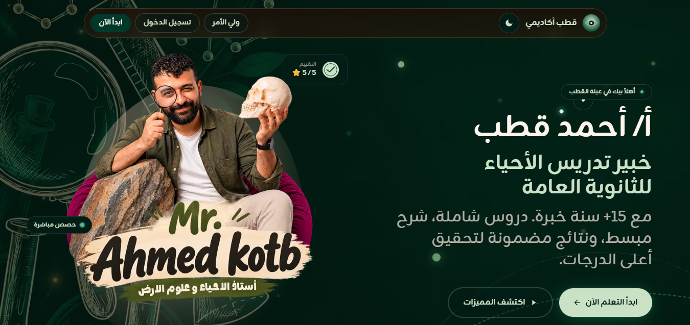

# Kotb Academy Platform

A production e-learning platform built for a large biology teacher in Egypt.

The platform serves students through lessons, exams, homework, video content, student management, payments, and a full administration dashboard.

> The source code is private due to client confidentiality.
> This repository is a case study showcasing my work, responsibilities, technical contributions, and the production system architecture.

---

## 🚀 Project Overview

When I joined the project, the platform already had an existing codebase, but several important parts were unstable or incomplete.

The frontend, backend, database integrations, APIs, and some production flows required significant work before the platform could operate reliably.

My role was to understand an unfamiliar and relatively large codebase, fix the existing issues, improve the architecture and user experience, and implement multiple new features.

---

## 👨‍💻 My Role

**Full-Stack Developer & Platform Maintainer**

My responsibilities included:

* Understanding and working with a large existing codebase
* Fixing broken frontend/backend integrations
* Reconnecting APIs and database flows
* Fixing authentication and production issues
* Refactoring parts of the existing project
* Redesigning major parts of the UI/UX
* Implementing 15+ major features
* Working on video streaming and content delivery
* Handling deployment and production debugging
* Maintaining the platform after launch

---

## ✨ Key Features I Worked On

Some of the main features and improvements include:

* Advanced exam system
* Homework management
* Student management
* Admin dashboard improvements
* Student segmentation
* Exam access and progression logic
* PDF attachments for educational content
* Video streaming system
* Encrypted HLS video delivery
* Payment system improvements
* Account and access management
* Background processing
* Content management improvements
* Platform monitoring and tracking
* UI/UX redesign
* Production bug fixing and optimization

And several other improvements across the platform.

---

## 🛠 Tech Stack

### Frontend

* Next.js
* React
* TypeScript
* Tailwind CSS
* shadcn/ui
* Zustand

### Backend

* Express.js
* Bun
* TypeScript
* Prisma ORM

### Database & Caching

* PostgreSQL
* Redis

### Background Jobs

* BullMQ

### Video & Storage

* Cloudflare R2
* HLS Video Streaming
* AES-128 Video Encryption

### Infrastructure

* Docker
* VPS Hosting
* Cloudflare
* GitHub

---

## 🏗 Architecture

The platform follows a modern separated frontend/backend architecture.

```text
Students / Admins
        ↓
     Next.js
        ↓
   Express API
        ↓
     Prisma
        ↓
   PostgreSQL

Additional Services:

Redis
  ↓
Caching / Authentication / Temporary Data

BullMQ
  ↓
Background Jobs

Cloudflare R2
  ↓
Video & File Storage

HLS Streaming
  ↓
Protected Educational Videos
```

---

## 🎯 Challenges

One of the biggest challenges was working on a relatively large production project using a stack that was not originally my primary technology stack.

Instead of rebuilding the platform from scratch, I had to understand the existing architecture, database relationships, APIs, authentication system, frontend flows, and deployment environment.

This required debugging issues across multiple layers of the system and understanding how each part of the platform interacted with the others.

---

## 📈 What I Learned

This project significantly improved my experience in:

* Working with large existing codebases
* Understanding unfamiliar technologies quickly
* Debugging production systems
* Full-stack architecture
* API integration
* Database-driven applications
* Video streaming systems
* Redis caching
* Background jobs
* Deployment and production maintenance
* Designing features for real users

---

## 📸 Screenshots

### Homepage




## 🌐 Live Platform

Production platform:

**https://kotbacademy.com**

> Live website availability and content may change depending on the client's production environment.

---

## 🔒 Source Code

The production source code is not publicly available because this is a real client project.

This repository is intended to document the project, architecture, technologies used, and my contributions to the platform.
